# Billiard Club Kiosk — Flows & Manager Runbook

This document covers two complementary things:

1. **Flow diagrams** — every path a user (member) and admin (manager) can take through the system, drawn as Mermaid flowcharts (semantic equivalent to BPMN, easier to read inline).
2. **Manager runbook** — concrete step-by-step procedures for every situation a manager will face, written so a non-technical person can follow them without help.

> **Architecture reminder.** The system runs on **two devices** connected over the LAN:
> - **Raspberry Pi 5** — headless, hosts all backend services (Postgres, kiosk web app, admin web app, worker, observability) in Docker Compose. Reachable on the LAN as `billiard-kiosk.local`.
> - **Windows PC** — drives the 20" wall-mounted touchscreen via **Microsoft Edge in Kiosk Mode** (Windows Assigned Access), pointed at the Pi. The USB barcode scanner is connected to the **PC**. The PC also continues to host the existing STid Mobile ID member-management tooling on a separate Windows user account; the kiosk function is isolated.

---

## Part 1 — User & Admin Flow Diagrams

### 1.1 Kiosk Idle → Drink Purchase (scan-first interaction)

The primary interaction is **scanning** the drink's barcode. Tapping the on-screen grid is a fallback. Both end up in the same cart with the same animation.

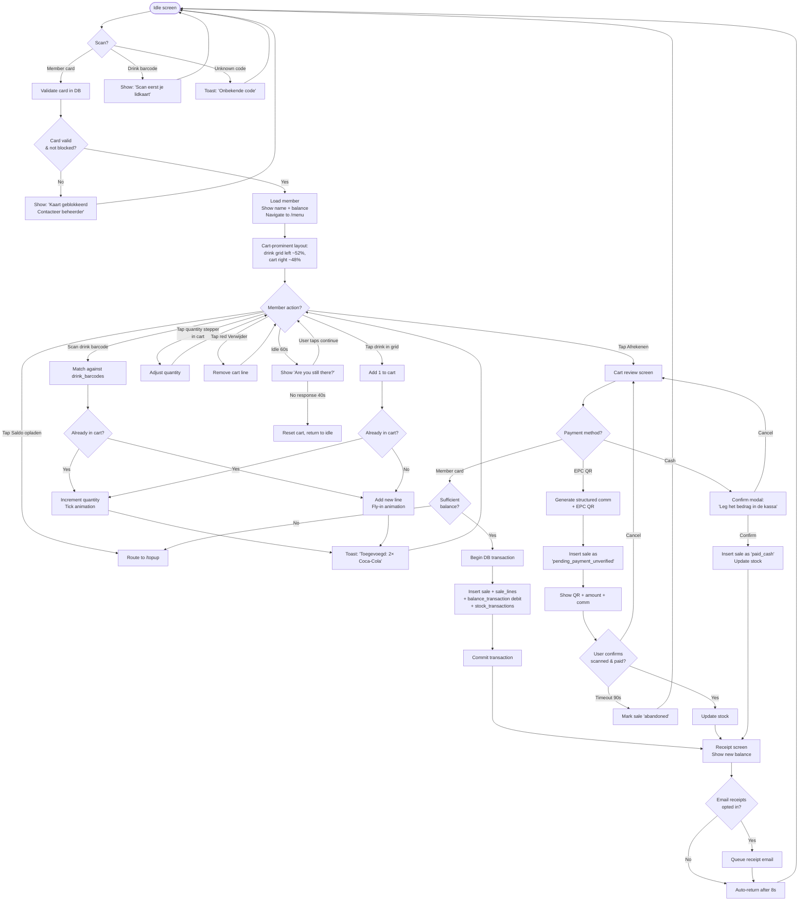

### 1.2 Top-up Flow (kiosk-initiated)

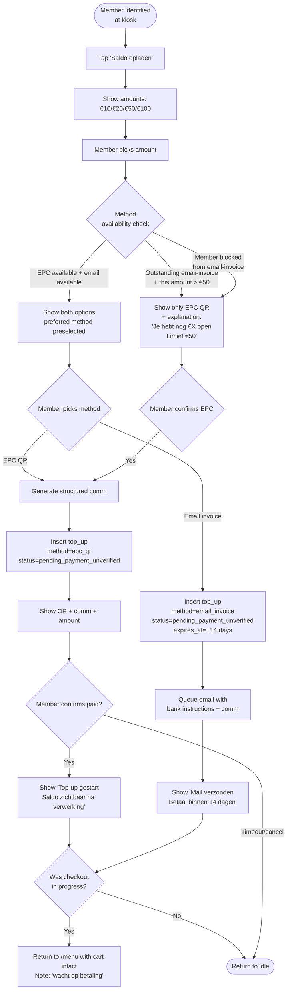

### 1.3 EPC QR Reconciliation (CODA Import)

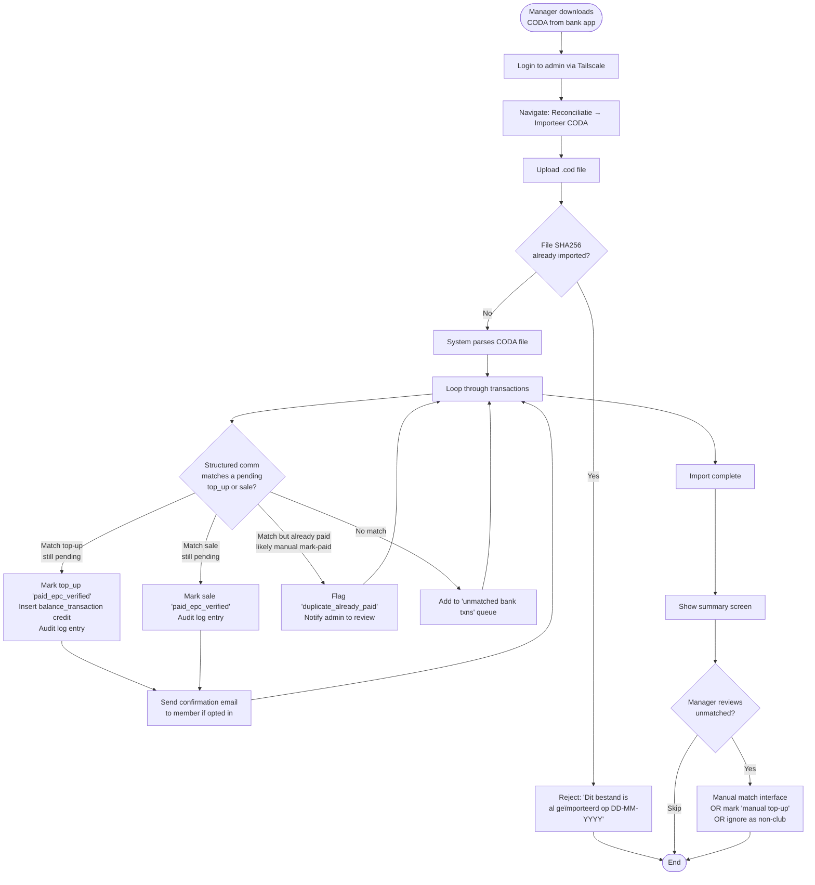

### 1.4 Admin: New Member Enrollment

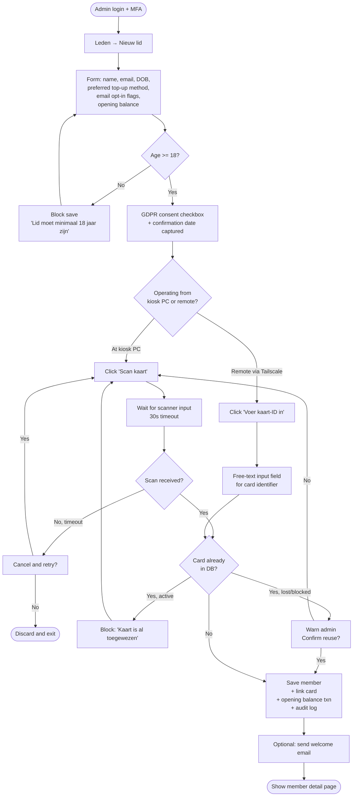

### 1.5 Admin: Lost Card Replacement

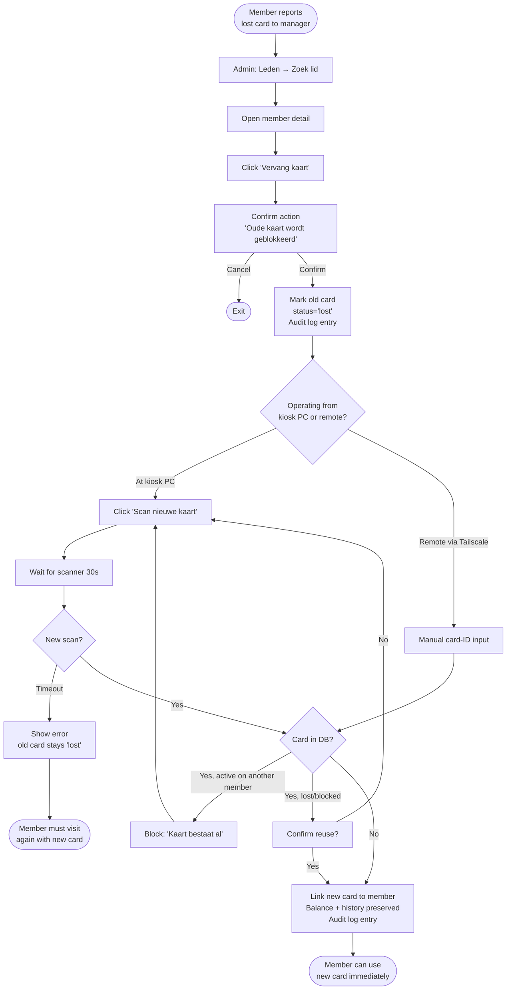

### 1.6 Admin: Manual Top-up Resolution (member paid offline)

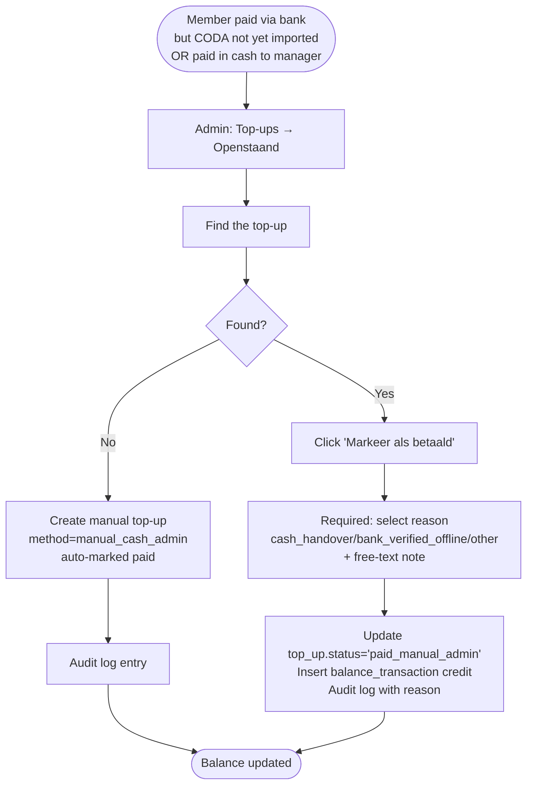

### 1.7 Admin: Stock Restocking

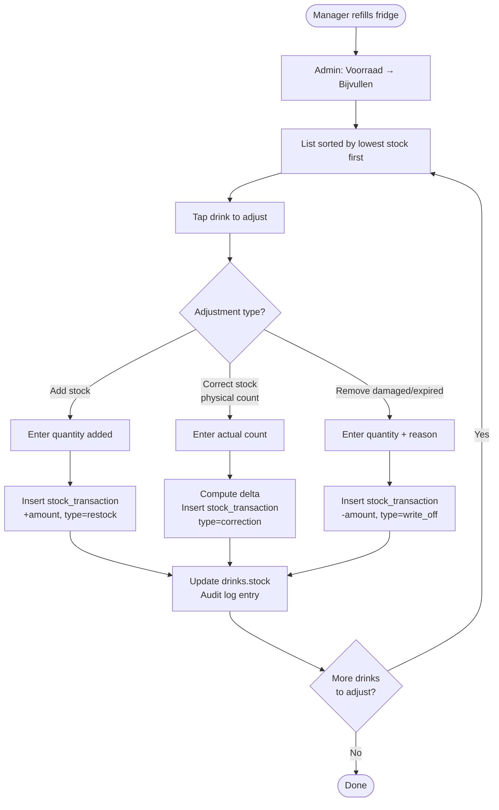

### 1.8 Admin: Resolving a Risk-Flagged Member

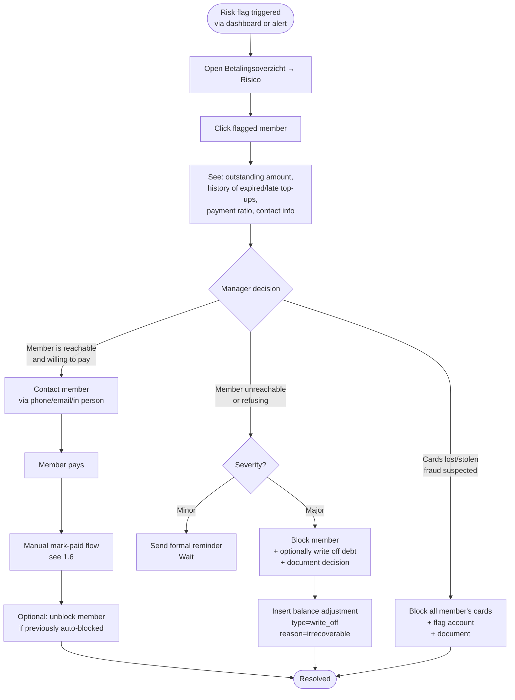

### 1.9 Admin: Adding/Editing a Drink

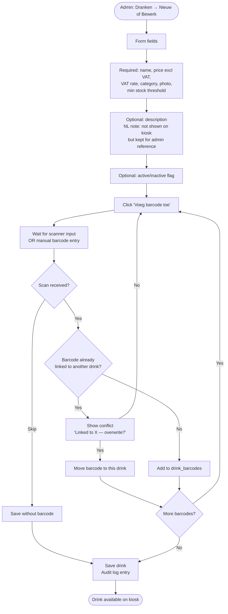

### 1.10 Admin: Settings Changes

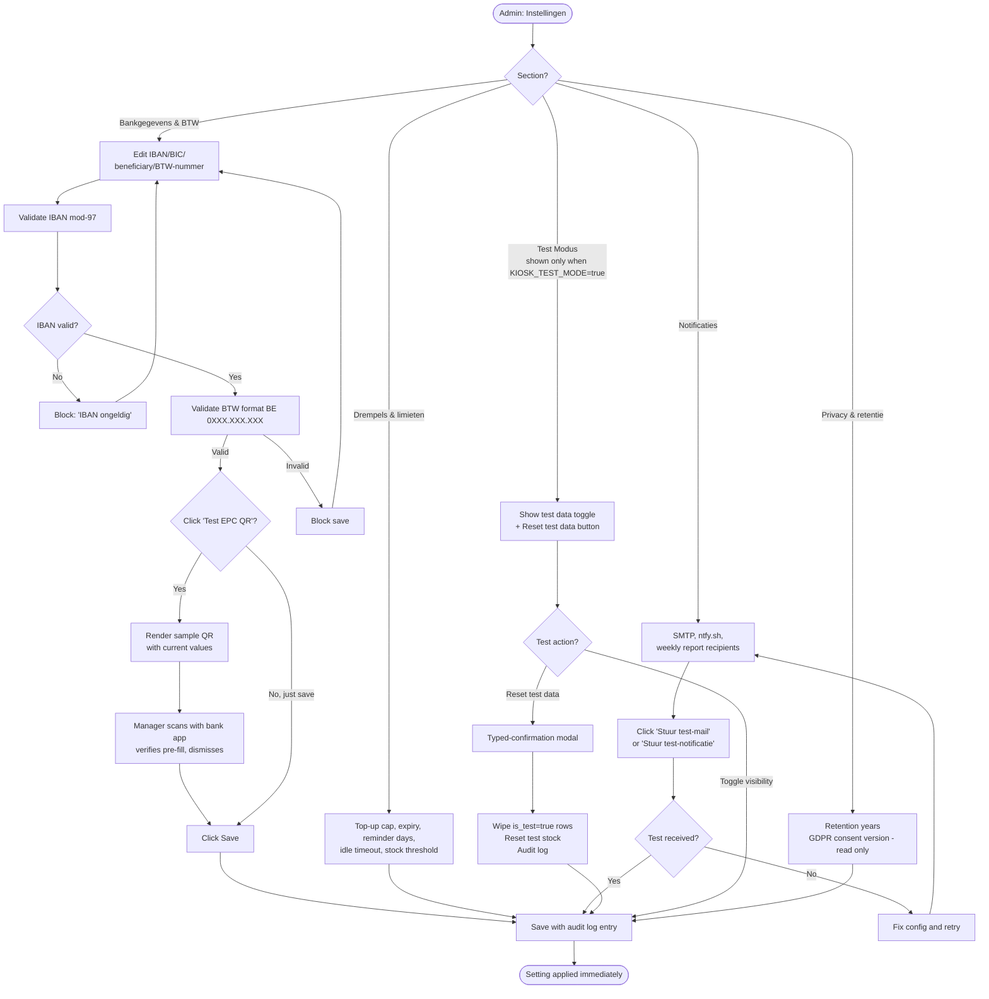

### 1.11 System: Background Jobs (Cron)

```mermaid
flowchart TD
    subgraph Hourly
        H1([Every hour]) --> H2[Check pending top-ups]
        H2 --> H3{Past expires_at?}
        H3 -->|Yes| H4[Mark expired<br/>Send alert to admins<br/>Audit log]
        H3 -->|No, day 7| H5[Send reminder email]
        H3 -->|No, day 13| H5
        H4 --> H6[Check member: 2 expired<br/>in 12 months?]
        H6 -->|Yes| H7[Auto-block member<br/>Send admin alert]
    end
    subgraph Daily02:00
        D1([Daily 02:00]) --> D2[pg_dump → encrypt → upload to cloud]
        D2 --> D3[Verify upload]
        D3 --> D4[Rotate: keep 30 daily, 12 monthly]
        D4 --> D5[Send success or failure alert]
    end
    subgraph Daily07:00
        DM1([Daily 07:00]) --> DM2[Compute risk-flag digest]
        DM2 --> DM3{Any new flags<br/>since yesterday?}
        DM3 -->|Yes| DM4[Email + ntfy digest to admins]
        DM3 -->|No| DM5([Skip])
    end
    subgraph WeeklyMon08:00
        W1([Monday 08:00]) --> W2[Generate weekly report]
        W2 --> W3[Compile metrics + Excel attachment<br/>Filter is_test=false]
        W3 --> W4[Email to opted-in admins]
    end
    subgraph Continuous
        U1([Uptime Kuma every 30s]) --> U2{All services up?}
        U2 -->|No, 3 fails| U3[Alert via email + ntfy]
        K1([Kiosk heartbeat check<br/>every 2 minutes]) --> K2{Heartbeat<br/>within 2 min?}
        K2 -->|No| K3[Alert: 'Kiosk display unresponsive']
    end
```

### 1.12 High-Level Service Topology

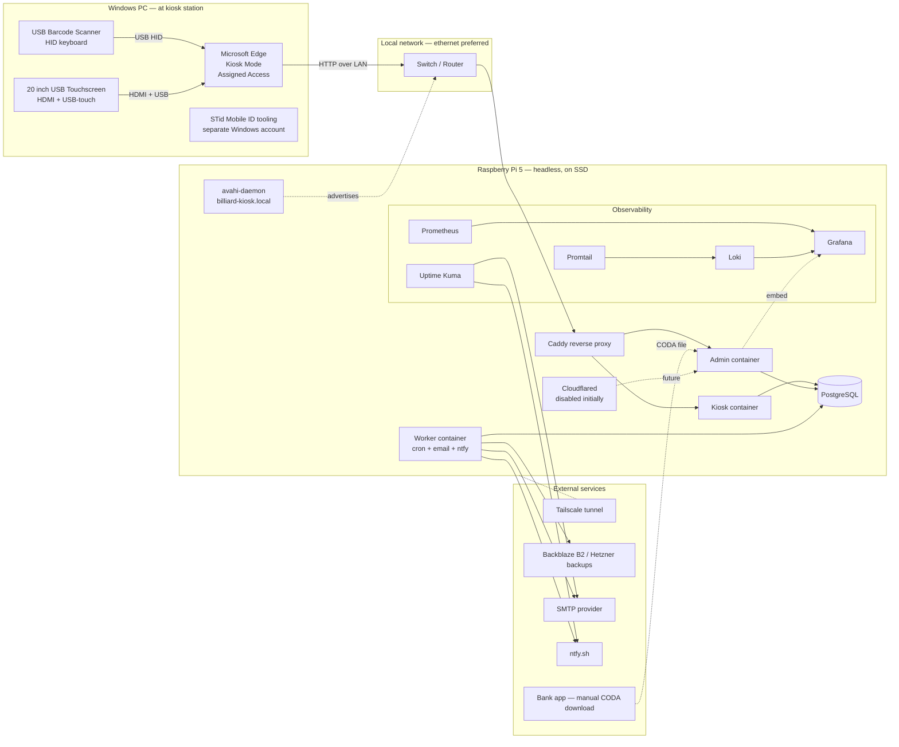

### 1.13 Test Mode Flow

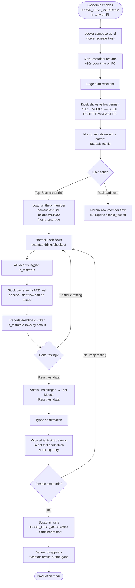

### 1.14 Network Connectivity Loss (PC ↔ Pi)

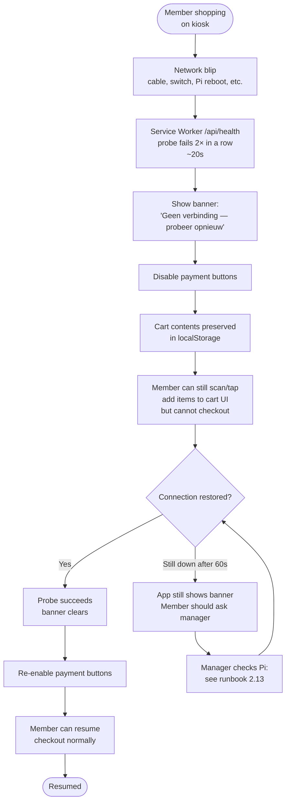

---

## Part 2 — Manager Runbook

> **Audience:** non-technical managers of the billiard club. Each procedure is short, numbered, and uses the same Dutch labels as the admin UI.

### 2.1 First-time setup (one-time, by main admin)

1. Receive Tailscale invitation email from system administrator.
2. Install Tailscale app on phone or laptop. Sign in with the email used in the invitation.
3. Once connected, open a browser and go to `https://admin.<tailnet>.ts.net` (exact URL provided by sysadmin).
4. Log in with provided email + initial password.
5. **Change password immediately** at *Mijn account → Wachtwoord*.
6. Set up MFA at *Mijn account → MFA*. Scan QR with Google Authenticator / Microsoft Authenticator / Authy.
7. Verify MFA works by logging out and back in.

---

### 2.2 Adding a new member

1. *Leden → Nieuw lid*.
2. Fill in: name, email, date of birth (must be ≥18), opening balance (usually €0).
3. Choose preferred top-up method (EPC QR is recommended).
4. Toggle email-receipts opt-in (member's preference).
5. Tick the GDPR consent checkbox **only after** the member has signed the paper form / verbally confirmed.
6. Click *Scan kaart* and scan the new STid QR within 30 seconds.
   - If you're working remotely (not at the kiosk PC), use *Voer kaart-ID in* and type the code.
7. Click *Opslaan*.
8. (Optional) Click *Stuur welkomstmail* to send the member their privacy notice + first-login link if applicable.

---

### 2.3 Member lost their card

1. *Leden → Zoek lid* → find by name or email.
2. Open member detail.
3. Click *Vervang kaart*.
4. Confirm "Oude kaart wordt geblokkeerd" — this is irreversible.
5. Click *Scan nieuwe kaart* and scan within 30 seconds.
6. Done. Balance and history are preserved on the new card.
7. Tell the member: "Je oude kaart werkt niet meer, gebruik de nieuwe."

> If the lost card is later found, do **not** unblock it. Always issue a new card.

---

### 2.4 Member paid via bank but balance not updated

This usually means the CODA file hasn't been imported yet. Do this:

1. *Reconciliatie → Importeer CODA*.
2. Download the latest CODA from the club's bank app (KBC / Belfius / Argenta — usually under "Documenten" or "Rekeninguittreksels").
3. Upload the `.cod` file.
4. Wait for parsing (a few seconds).
5. Review summary: matched / unmatched.
6. If member's payment is now matched → done.
7. If still unmatched, see **2.5**.

---

### 2.5 Member says they paid, but no matching bank entry

Possible causes: wrong structured communication, wrong amount, transfer still in flight (1-2 business days for some banks), or the member is mistaken.

1. Ask the member to send you a screenshot of the transfer.
2. *Top-ups → Openstaand* → find the top-up.
3. If the screenshot proves payment but bank hasn't shown it yet, click *Markeer als betaald*.
4. Reason: select *bank_verified_offline*. Add note with the date the member showed proof.
5. Save. Balance updates immediately.
6. When the next CODA is imported, the system will detect the duplicate (same structured communication paid twice) and flag it for your review — usually nothing to do, but it's auditable.

---

### 2.6 Member paid in cash for a top-up

1. Take the cash, put it in the secure box.
2. *Top-ups → Nieuw handmatig top-up*.
3. Select member → enter amount → method *manual_cash_admin*.
4. Add note (optional, e.g. "Ontvangen op zaterdag avond").
5. Save. Balance updates immediately.

---

### 2.7 Resolving a risk-flagged member

The dashboard *Betalingsoverzicht → Risico* shows members who have payment problems.

1. Click on the flagged member.
2. Review their history: total outstanding €, expired top-ups, payment ratio.
3. Decide:
   - **Understanding case** (forgot, traveling, etc.): contact them. Once paid, follow **2.5** or **2.6**, then *Deblokkeer lid* if blocked.
   - **Unreachable / refusing**: send a formal reminder email via *Stuur herinnering*. Wait 14 days.
   - **Confirmed bad debt**: *Lid → Acties → Schuld afschrijven*. Enter amount and reason. The member is auto-blocked. Document decision.
4. All actions are logged in the audit trail.

---

### 2.8 Restocking the fridges

1. Refill the fridges.
2. *Voorraad → Bijvullen*.
3. Drinks are sorted by lowest stock first.
4. For each drink you added, tap → enter quantity added → save.
5. Optional: do a physical count once a month using *Correctie* mode — system computes the delta automatically.

---

### 2.9 A drink price changes

1. *Dranken → bewerk*.
2. Change *Verkoopprijs incl. BTW* (or excl. + VAT rate, system computes the other).
3. Save. Audit log entry created.
4. Existing sales history is unaffected (prices are snapshotted per sale).

---

### 2.10 Adding a new drink

1. *Dranken → Nieuw*.
2. Fill in: name, description (optional, **not shown on the kiosk**, kept for admin reference), category, buying price, selling price, VAT rate, photo, initial stock, low-stock threshold.
3. Click *Voeg barcode toe* and scan all variants of the product. The barcode scanner is connected to the **kiosk PC**, so this step is easiest done at the kiosk station. If you're remote, you can manually type the barcode digits.
4. Save. Drink appears on the kiosk immediately if marked active.

---

### 2.11 Stock alert received (email or ntfy)

1. The alert lists the drinks below threshold.
2. Plan a refill. No urgent system action needed.
3. After refilling, follow **2.8**.

---

### 2.12 The kiosk display shows an error / is frozen

In order:

1. **Wait 30 seconds.** Microsoft Edge auto-relaunches on crash via Windows Assigned Access. Most issues recover on their own.
2. **Tap the screen** to wake it up if the display has gone dark.
3. **If still frozen after 1 minute**, do a clean PC restart:
   - If touchscreen still responds: bottom-corner of screen, swipe to access Windows actions, choose Restart. (If Edge Kiosk Mode hides this, see step 4.)
   - Otherwise: press the PC's physical power button briefly (do **not** hold it). Windows will perform a graceful restart. The PC will auto-login and Edge will relaunch into kiosk mode.
4. **If the PC is fully unresponsive**, hold the PC's physical power button for 10 seconds to force off. Wait 5 seconds. Press once to power on. Auto-login and Edge will restart.
5. **If still broken after PC restart**, the Pi may be the issue. Continue with **2.13** to check network/Pi.
6. **If everything looks broken**, contact sysadmin via the support channel. Mention: time it started, what was happening, any error message text.

> The kiosk being down does not affect the database or admin app. Admin remains accessible via Tailscale from anywhere.

---

### 2.13 The kiosk shows "Geen verbinding"

This means the PC's Edge can't reach the Pi.

1. Check the Pi is powered on (LED visible on the Pi, fan running if applicable).
2. Check the cable between the Pi and the network switch / router. Reseat it on both ends.
3. Check the Pi's ethernet LED is lit.
4. If using WiFi instead of ethernet (not recommended), verify the WiFi router is on and reachable.
5. Wait 60 seconds. The Service Worker auto-recovers when connectivity returns.
6. If still no connection, restart the Pi by unplugging power for 10 seconds and plugging back in. Wait 90 seconds for it to boot.
7. If still broken after Pi restart, contact sysadmin.

> The kiosk app shows "Geen verbinding" within ~20 seconds of losing the Pi. Cart contents are preserved — the member doesn't lose what they added once connection comes back.

---

### 2.14 Weekly report didn't arrive Monday morning

1. Check email spam folder.
2. *Rapporten → Wekelijks rapport → Stuur nu* — sends today's report immediately.
3. *Instellingen → Notificaties → Rapport ontvangers* — verify your email is ticked.
4. If button doesn't work, contact sysadmin.

---

### 2.15 Adding a new manager / admin user

1. *Beheerders → Nieuwe beheerder*.
2. Enter their email and name. System sends them an invite with a one-time link.
3. They follow **2.1** themselves.
4. Decide whether they should receive the weekly report (toggle).

---

### 2.16 Removing a manager

1. *Beheerders → bewerk*.
2. Click *Deactiveer*.
3. Confirm. They lose access immediately. Audit log shows their previous actions.

> Don't fully delete admins — deactivation preserves the audit trail.

---

### 2.17 GDPR data request from a member

**Member asks for their data:**

1. *Leden → bewerk → GDPR → Exporteer data*.
2. System generates a JSON file with all their data.
3. Download and email to the member (use a secure method, not plain email if possible).

**Member asks to be deleted:**

1. *Leden → bewerk → GDPR → Anonimiseer*.
2. Member's name → "Geanonimiseerd lid #1234". Email cleared. DOB cleared. Card unlinked.
3. Sales remain in the database for 7-year accounting retention but are no longer linked to a person.
4. Audit log entry created.

---

### 2.18 End-of-month reconciliation checklist

Once a month, ideally first week:

1. Download last month's CODA from the bank.
2. *Reconciliatie → Importeer CODA*.
3. Review unmatched bank transactions. Manually resolve any genuine club payments that didn't auto-match.
4. *Rapporten → Maandrapport* → download Excel for accountant.
5. Send Excel + bank statement to accountant.

---

### 2.19 Backup recovery (rare, sysadmin-led)

This is a sysadmin task, but as a manager you should know:

- Backups run nightly to encrypted cloud storage.
- 30 daily + 12 monthly retention.
- If the Pi is destroyed, sysadmin can restore the entire system to a new Pi in ~30 minutes. The Windows PC keeps working as before — only the URL changes if needed.
- Restore procedure is documented in the technical README and **must be tested at least once a year**.

If something looks lost (e.g. a member says their balance dropped without reason), don't restore — just check the audit log first via *Logboek*.

---

### 2.20 Switching between kiosk and STid manager account on the PC

The PC hosts two functions on two separate Windows accounts:

- A **`kiosk` account** — auto-login, locked to Edge Kiosk Mode showing the drink kiosk.
- A **`manager` account** — used for STid Mobile ID member management (door access).

**To do STid work:**

1. At the kiosk screen, press **Ctrl+Alt+Del** on the PC's keyboard (or **Win+L** to lock).
2. Choose **Switch user** or **Sign in as another user**.
3. Choose the manager account, enter password.
4. Do your STid work normally.
5. **Sign out fully** when done (Start menu → user icon → Sign out — *do not* just lock or switch user).
6. The PC auto-logs back into the kiosk account within seconds.
7. Edge Kiosk Mode resumes automatically. The kiosk screen returns.

> Always sign out fully. Leaving multiple sessions logged in wastes PC memory and can cause problems for the kiosk.

---

### 2.21 Updating the club's bank account or VAT details

When the club's IBAN, BIC, beneficiary name, or BTW-nummer change (e.g. switching banks):

1. *Instellingen → Bankgegevens & BTW*.
2. Update the relevant fields.
   - **IBAN** is validated automatically — you'll get an error if you mistype.
   - **BTW-nummer** is checked against Belgian format `BE 0XXX.XXX.XXX`.
3. Click *Test EPC QR genereren*. A sample QR appears.
4. Scan the sample QR with your bank app. Verify it pre-fills with the new IBAN, beneficiary, etc. **Do not confirm the transfer in the bank app — just check it pre-filled correctly and dismiss.**
5. Click *Opslaan*.
6. Audit log entry created.

> **Important:** any EPC QR sales already pending (status `pending_payment_unverified`) still reference the **old** bank details when their members eventually pay. This is correct — the QR was generated for those specific transactions before the change. New sales after this point use the new details.
>
> If the bank account fully closes, contact sysadmin to coordinate — old structured communications may not reconcile via CODA from the new account.

---

### 2.22 Using test mode (demonstrations, training, QA)

Test mode is for:
- Demonstrating the system to new managers without using a real card.
- Training scenarios.
- Sanity-checking after an update.

**Enabling test mode** requires the sysadmin (it's a server-side flag, not a user setting). They'll set `KIOSK_TEST_MODE=true` in the Pi's configuration and restart the kiosk container. Takes about 30 seconds.

**While test mode is active:**
- A persistent yellow banner across the top of every kiosk screen reads **"TEST MODUS — GEEN ECHTE TRANSACTIES"**.
- The idle screen shows an extra button: **"Start als testlid"**.
- Tap *Start als testlid* to begin a test session. You become "Test Lid" with a €1000 balance and can scan, tap, checkout, top up — anything a real member can do.
- Real cards still work alongside, so you can also test the real-member path.

**During test mode, all test transactions are tagged in the database.** Reports and risk dashboards filter them out by default. To see test data in reports, enable *Instellingen → Test Modus → Toon test data*.

**Stock decrements are real** — this is on purpose so you can test the stock alert flow. To reset:
- *Instellingen → Test Modus → Reset test data*.
- Typed confirmation required.
- Wipes all test members, sales, top-ups, balance entries; resets test drink stock.

**Disabling test mode:**
- Tell sysadmin. They flip the flag back and restart. The yellow banner disappears.

> **Never leave test mode on in production.** The yellow banner is your safety check — if you see it during normal hours, something is wrong. Contact sysadmin.

---

### 2.23 Quick cheat sheet — "what do I do if…"

| Situation | Action |
|---|---|
| New member walks in | 2.2 |
| Member lost card | 2.3 |
| Member's bank payment not showing | 2.4 → 2.5 |
| Member paid cash for top-up | 2.6 |
| Risk-flag dashboard shows red | 2.7 |
| Fridges empty | 2.8 |
| Need to change a drink price | 2.9 |
| Adding a new drink to the menu | 2.10 |
| Got a low-stock alert | 2.11 |
| Touchscreen frozen | 2.12 |
| Kiosk says "Geen verbinding" | 2.13 |
| Weekly report missing | 2.14 |
| Onboarding a co-manager | 2.15 |
| Removing a co-manager | 2.16 |
| Member GDPR request | 2.17 |
| Monthly close | 2.18 |
| System destroyed / catastrophic loss | 2.19 — call sysadmin |
| Need to use the PC for STid work | 2.20 |
| Bank account / VAT details changed | 2.21 |
| Demo or training the system | 2.22 |

---

## Part 3 — Notes for the Antigravity prompt

When we draft the Antigravity prompt, the following items from this document need to translate into actual built features (not just docs):

- Every screen, button label, and Dutch microcopy referenced in the runbook must exist in the admin app or kiosk app.
- Each cron job in 1.11 must be implemented in the worker container.
- The risk-flag algorithm in 1.8 must be coded with the exact thresholds discussed.
- The audit log must capture every action listed across runbook sections 2.2–2.22.
- The reconciliation flow (1.3) must include the manual-match interface and duplicate-already-paid detection.
- The settings page (1.10) must surface every configurable threshold AND the Bankgegevens & BTW section with IBAN/BTW validation and the *Test EPC QR genereren* preview button.
- The GDPR export and anonymize flows (2.17) must be implemented as actual endpoints.
- The test mode flow (1.13, 2.22) must be implemented including the persistent banner, *Start als testlid* button, `is_test=true` tagging on members/sales/top-ups/balance_transactions, default report filtering, and *Reset test data* admin action.
- The connectivity-loss handling (1.14) must be implemented via Service Worker plus disabled payment buttons while the banner is active.
- The drink description field stays in the database but never renders on the kiosk drink tile.
- Both kiosk and admin scan flows must support manual-input fallback for managers operating remotely (without scanner access).

The flow diagrams and runbook themselves are reference documentation — they go alongside the built system, not into it.
